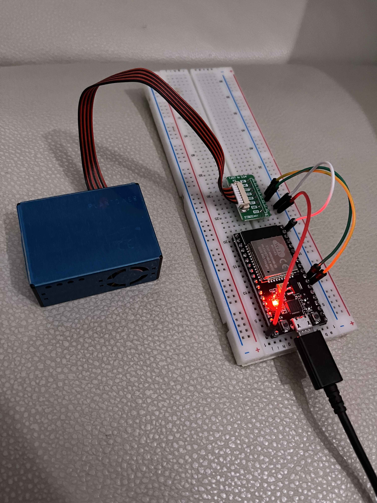

# esp32-air-quality-to-statsd

Code to make an ESP32 take particulate readings from a [PMS5003](https://www.google.com/search?q=PMS5003+) and send to a [statsd server](https://www.datadoghq.com/blog/statsd/).

Wiring in this example is on a ESP32-s NodeMCU using the UART2 pins.
