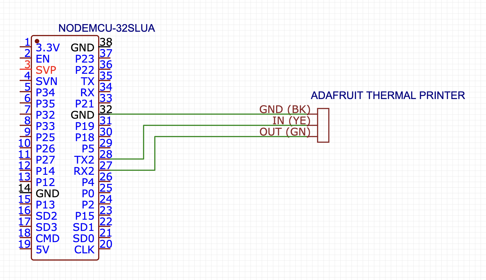

# esp32-thermal-printer-espidf

It's an [Adafruit Thermal Printer](https://www.adafruit.com/product/597) with endpoints for printing Markdown


> Visit `<esp-ip-address>` in the browser for a web print page

```bash
# markdown with body
curl -X POST -d '# h1 test\n## h2 test\n **bold**' <esp-ip-address>/print

# markdown as a file
$ curl -F 'data=@testfile.txt' <esp-ip-address>/print
```

## Parts

* [ESP32-WROOM32](https://www.amazon.com/HiLetgo-ESP-WROOM-32-Development-Microcontroller-Integrated/dp/B0718T232Z) (my board is the nodemcu-32s with 4MB of flash)
* [Adafruit Thermal Printer](https://www.adafruit.com/product/597)
* [dklon's Thermal Printer enclosure](https://www.thingiverse.com/thing:3124661)

## Wiring



* Printer yellow to ESP32 TX2
* Printer green to ESP32 RX2
* Tie grounds together
* Tie a 5-9v 1.5-2A wall wart to printer and ESP32's 5v pin

## Development

Requires PlatformIO to be installed

```bash
# run the unit tests
$ make test

# compile the firmware
$ make build

# flash and monitor for logs
$ make run monitor
```

## Secrets

A `secrets.h` file with the following should be placed in `src/` 

```C++
const char *ssid_name = "ssid";
const char *ssid_password = "password";
const char *firmware_url = "https://path-to-firmware.bin";
```

`firmware_url` allows an optional path to download an OTA update. Trigger the download and reboot with a `POST` to `/ota`.

## API

|path|example|
|-|-|
|/print|`curl -X POST -d '# h1 test\n## h2 test\n **bold**' <esp-ip-address>/print`
|/ping|`curl <esp-ip-address>/ping`
|/ota|`curl -X POST <esp-ip-address>/ota`